## **1. Arduino Uno Board**


**ຄຳອະທິບາຍ:** Arduino Uno ແມ່ນ microcontroller board ທີ່ອີງໃສ່ ATmega328P chip ເປັນສະໝອງກາງຂອງໂຄງການທັງໝົດ

**Schematic Diagram:**

```
        USB Port
          │
    ┌─────┴─────┐
    │  ARDUINO  │
    │    UNO    │
    │           │
 ┌──┤ ATmega328│──┐
 │  │           │  │
 │  └───────────┘  │
 │                 │
Digital Pins     Analog Pins
(0-13)           (A0-A5)
 │                 │
GND  5V  3.3V   GND  AREF
```

**ສ່ວນປະກອບສຳຄັນ:**

- **ATmega328P Microcontroller:** ໂປຣເຊດເຊີ 8-bit, 16MHz
- **Digital I/O Pins (0-13):** 14 pins (6 pins ສາມາດໃຊ້ PWM)
- **Analog Input Pins (A0-A5):** 6 pins ອ່ານຄ່າແບບ analog
- **Power Pins:** VIN, 5V, 3.3V, GND
- **Reset Button:** ກົດເພື່ອ restart ໂປແກຼມ
- **USB Port:** ສຳລັບອັບໂຫຼດໂປແກຼມ ແລະ ສະໜອງໄຟ
- **DC Power Jack:** ຮັບໄຟ 7-12V

**ການເຮັດວຽກ:**

- ຮັບໂປແກຼມຈາກຄອມພິວເຕີຜ່ານ USB
- ປະມວນຜົນຄຳສັ່ງຕາມໂປແກຼມທີ່ອັບໂຫຼດ
- ຄວບຄຸມ input/output ກັບເຊັນເຊີ ແລະ actuators

**ຕົວຢ່າງການນຳໃຊ້:**

- ສ້າງລະບົບຄວບຄຸມອຸນຫະພູມອັດຕະໂນມັດ
- ພັດທະນາ robot ຫຼິ້ນເດັກ
- IoT projects ເຊື່ອມຕໍ່ອິນເຕີເນັດ

---

## 2. Breadboard (ແຜ່ນທົດລອງ)
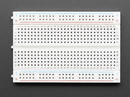
**ຄຳອະທິບາຍ:** Breadboard ແມ່ນແຜ່ນທົດລອງທີ່ບໍ່ຕ້ອງບັດກີ່ ໃຊ້ສຳລັບຕໍ່ວົງຈອນຊົ່ວຄາວ

**Schematic Diagram:**

```
Power Rails (ແຖວໄຟ)
+ ━━━━━━━━━━━━━━━━━ (ສີແດງ)
- ━━━━━━━━━━━━━━━━━ (ສີດຳ/ສີຟ້າ)

Terminal Strips (ແຖວຕໍ່ອຸປະກອນ)
a  ● ● ● ● ● ... ●
b  ● ● ● ● ● ... ●
c  ● ● ● ● ● ... ●
d  ● ● ● ● ● ... ●
e  ● ● ● ● ● ... ●
   ═══════════════ (ຊ່ອງກາງ)
f  ● ● ● ● ● ... ●
g  ● ● ● ● ● ... ●
h  ● ● ● ● ● ... ●
i  ● ● ● ● ● ... ●
j  ● ● ● ● ● ... ●

- ━━━━━━━━━━━━━━━━━
+ ━━━━━━━━━━━━━━━━━
```

**ສ່ວນປະກອບ:**

- **Power Rails:** ແຖວແນວຕັ້ງເຊື່ອມຕໍ່ກັນທັງໝົດ (+5V, GND)
- **Terminal Strips:** ແຖວແນວນອນ (a-j) ແຕ່ລະຄໍລຳມີ 5 ຮູເຊື່ອມຕໍ່ກັນ
- **Center Gap:** ຊ່ອງກາງສຳລັບສອດ IC chips

**ການເຮັດວຽກ:**

- ຂາອຸປະກອນທີ່ສອດລົງໃນແຖວດຽວກັນຈະເຊື່ອມຕໍ່ກັນໂດຍອັດຕະໂນມັດ
- ບໍ່ຕ້ອງບັດກີ່ ສາມາດປ່ຽນແປງວົງຈອນໄດ້ງ່າຍ

**ຕົວຢ່າງການນຳໃຊ້:**

- ທົດສອບວົງຈອນໄຟຟ້າກ່ອນບັດກີ່ຖາວອນ
- ສ້າງ prototype ໂປຣເຈັກ Arduino
- ສອນນັກຮຽນກ່ຽວກັບວົງຈອນໄຟຟ້າ

---

## 3. USB Cable (ສາຍ USB)
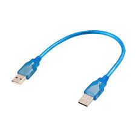
**ຄຳອະທິບາຍ:** ສາຍ USB Type A ຫາ Type B ສຳລັບເຊື່ອມຕໍ່ Arduino ກັບຄອມພິວເຕີ

**Pinout Diagram:**

```
USB Type A (ຄອມພິວເຕີ)    USB Type B (Arduino)
    ┌───────┐              ┌─────────┐
    │ ┌───┐ │              │  ┌───┐  │
    │ │ ▪ │ │              │  │ │ │  │
    │ │ ▪ │ │              │  │ │ │  │
    │ │ ▪ │ │              │  │ │ │  │
    │ │ ▪ │ │              │  │ │ │  │
    │ └───┘ │              │  └───┘  │
    └───────┘              └─────────┘
    
Pin Functions:
1. VCC  (+5V power)
2. D-   (Data negative)
3. D+   (Data positive)
4. GND  (Ground)
```

**ການເຮັດວຽກ:**

- ສົ່ງກະແສໄຟ 5V ຫາ Arduino (ສູງສຸດ 500mA)
- ສື່ສານຂໍ້ມູນແບບ serial ເພື່ອອັບໂຫຼດໂປແກຼມ
- ສົ່ງຂໍ້ມູນ debug ກັບຄືນມາຄອມພິວເຕີ

**ຕົວຢ່າງການນຳໃຊ້:**

- ອັບໂຫຼດ sketch ຈາກ Arduino IDE
- ສະແດງຜົນການຕິດຕາມ (Serial Monitor)
- ສະໜອງໄຟໃຫ້ໂຄງການຂະໜາດນ້ອຍ

---

## 4-6. Jumper Wires (ສາຍຈັ໊ມເປີ)

**ຄຳອະທິບາຍ:** ສາຍເຊື່ອມຕໍ່ທີ່ມີຫົວຕໍ່ 3 ປະເພດ

**ປະເພດສາຍ:**

```
Male-to-Male (M-M):    Male-to-Female (M-F):   Female-to-Female (F-F):
  ▬▬▬▬▬                  ▬▬▬▬▬                    ▬▬▬▬▬
  ╪    ╪                 ╪    ║                   ║    ║
  Pin  Pin               Pin  Socket              Socket Socket
```

**4. Male-to-Male:**
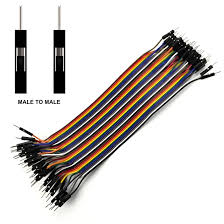
- ໃຊ້ບົນ breadboard
- ເຊື່ອມຕໍ່ຈຸດຕ່າງໆ ໃນ breadboard

**5. Male-to-Female:**
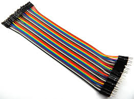
- ເຊື່ອມ Arduino pin ຫາ breadboard
- ເຊື່ອມ sensor module ຫາ breadboard

**6. Female-to-Female:**
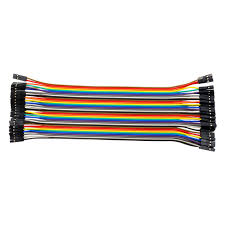
- ເຊື່ອມ module ທີ່ມີ male header ເຂົ້າກັນ
- ເຊື່ອມ Arduino male pins ຫາ sensor modules

**ການເຮັດວຽກ:**

- ນຳສັນຍານໄຟຟ້າ (digital/analog) ລະຫວ່າງອຸປະກອນ
- ມີສີຕ່າງໆ ເພື່ອຈຳແນກສາຍ (ແດງ=ໄຟບວກ, ດຳ=GND, ອື່ນໆ=signal)

**ຕົວຢ່າງການນຳໃຊ້:**

- ເຊື່ອມ LED ຫາ Arduino ຜ່ານ breadboard
- ສ້າງວົງຈອນທົດສອບໂດຍບໍ່ຕ້ອງບັດກີ່
- ຂະຫຍາຍການເຊື່ອມຕໍ່ໄປຫາເຊັນເຊີຫ່າງໄກ

---

## 7. 9V Battery Connector (ຫົວຕໍ່ຖ່ານ 9V)
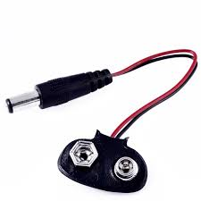
**ຄຳອະທິບາຍ:** Connector ສຳລັບຖ່ານ 9V ເຂົ້າກັບ Arduino ເພື່ອໃຊ້ງານແບບພົກພາ

**Schematic:**

```
Battery (9V):          Connector:        To Arduino:
    ┌─────┐               ╔═══╗            ┌──────┐
    │  +  │───Red Wire────║ + ║────────────│ VIN  │
    │ ═══ │               ║   ║            │      │
    │  -  │──Black Wire───║ - ║────────────│ GND  │
    └─────┘               ╚═══╝            └──────┘
     
Standard 9V Battery    DC Barrel Jack    Arduino Power In
(PP3 Type)            (2.1mm center +)
```

**ສ່ວນປະກອບ:**

- **ຫົວຄລິບຖ່ານ:** ຫົວຕໍ່ແບບ snap-on ສຳລັບຖ່ານ 9V
- **ສາຍແດງ (+):** ເຊື່ອມຫາ VIN ຂອງ Arduino
- **ສາຍດຳ (-):** ເຊື່ອມຫາ GND
- **DC Barrel Jack:** ສອດເຂົ້າຕຳແໜ່ງໄຟ Arduino

**ການເຮັດວຽກ:**

- Arduino ມີ voltage regulator ຫຼຸດ 9V ລົງເປັນ 5V
- ຮັບປະກັນວ່າ Arduino ແລະ circuits ຮັບໄຟ 5V ທີ່ຖືກຕ້ອງ
- ຖ່ານ 9V ໃຫ້ກະແສປະມານ 400-600mAh

**ຕົວຢ່າງການນຳໃຊ້:**

- ສ້າງ robot ທີ່ເຄື່ອນຍ້າຍໄດ້ໂດຍບໍ່ຕ້ອງສາຍໄຟ
- ໂຄງການ outdoor monitoring ທີ່ບໍ່ມີປ່ຽງໄຟ
- ອຸປະກອນພົກພາເຊັ່ນ: weather station

---

## 8. LEDs (ໄຟ LED)
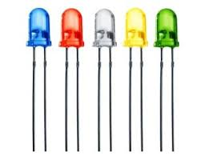
**ຄຳອະທິບາຍ:** Light Emitting Diodes - ອຸປະກອນທີ່ປ່ຽນກະແສໄຟເປັນແສງສະຫວ່າງ

**Schematic & Pinout:**

```
Standard LED:           RGB LED (4-pin):
    
  Anode (+)              Common Cathode
     │                      │
    ╱│╲                  ┌──┴──┐
   ╱ │ ╲                 │  -  │ (longest)
  │  │  │                ├─────┤
   ╲ │ ╱                 │  R  │ Red
    ╲│╱                  ├─────┤
     │                   │  G  │ Green
  Cathode (-)            ├─────┤
  (shorter leg)          │  B  │ Blue
                         └─────┘

Circuit with Resistor:
Arduino Pin ──→ 220Ω ──→ LED+ ──→ LED- ──→ GND
```

**ໃນຊຸດມີ:**

- **5x Red LEDs** (ແສງແດງ) - 1.8-2.0V forward voltage
- **5x Yellow LEDs** (ແສງເຫຼືອງ) - 2.0-2.2V
- **5x Blue LEDs** (ແສງສີຟ້າ) - 3.0-3.4V
- **1x RGB LED** (ປ່ຽນສີໄດ້) - 3 ສີລວມກັນ

**ການເຮັດວຽກ:**

- ເມື່ອມີກະແສໄຟຜ່ານທິດທາງຖືກຕ້ອງ (anode → cathode) LED ຈະປ່ອຍແສງ
- **ຕ້ອງໃຊ້ resistor** ເພື່ອຈຳກັດກະແສ (ປົກກະຕິ 220Ω ກັບ 5V)
- RGB LED ສາມາດປະສົມສີໄດ້ໂດຍການຄວບຄຸມແຕ່ລະສີດ້ວຍ PWM

**ການຄິດໄລ່ Resistor:**

```
R = (Vs - Vf) / If
ຕົວຢ່າງ: R = (5V - 2V) / 0.02A = 150Ω (ໃຊ້ 220Ω ປອດໄພກວ່າ)
```

**ຕົວຢ່າງການນຳໃຊ້:**

- LED ກະພິບເປັນສັນຍານເຕືອນ
- ສະແດງສະຖານະຂອງລະບົບ (ສີເຂົ້າ, ສີເຫຼືອງ, ສີແດງ)
- ສ້າງໂຄງການສ່ອງສະຫວ່າງ ຫຼື ຕົບແຕ່ງ RGB

---

## 9. RGB Module
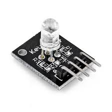
**ຄຳອະທິບາຍ:** Module RGB LED ທີ່ມີ resistors ພ້ອມນຳໃຊ້ງານ

**Pinout Diagram:**

```
RGB Module (Common Cathode):
    ┌──────────┐
    │   RGB    │
    │  ┌────┐  │
    │  │ ▓▓ │  │ ← LED RGB ພາຍໃນ
    │  └────┘  │
    │  R G B - │ ← 4 pins
    └──┬─┬─┬─┬─┘
       │ │ │ │
       │ │ │ └─→ GND (Common Cathode)
       │ │ └───→ Blue (PWM pin)
       │ └─────→ Green (PWM pin)
       └───────→ Red (PWM pin)

Connection to Arduino:
R pin → Digital Pin 9 (PWM)
G pin → Digital Pin 10 (PWM)
B pin → Digital Pin 11 (PWM)
- pin → GND
```

**ຂໍ້ໄດ້ປຽບເທິງ LED ທຳມະດາ:**

- ມີ resistors ພ້ອມຢູ່ແລ້ວ (ບໍ່ຕ້ອງຕໍ່ເພີ່ມ)
- Pin header ສຳເລັດຮູບ ງ່າຍຕໍ່ການເຊື່ອມ
- PCB ເຮັດໃຫ້ການຕິດຕັ້ງໜັກແໜ້ນ

**ການເຮັດວຽກ:**

- ໃຊ້ PWM (Pulse Width Modulation) ຄວບຄຸມຄວາມສະຫວ່າງແຕ່ລະສີ
- ປະສົມສີ 3 ສີພື້ນຖານໄດ້ 16.7 ລ້ານສີ (256 x 256 x 256)
- ຄ່າ PWM: 0 (ດັບ) ຫາ 255 (ສະຫວ່າງສຸດ)

**Code ຕົວຢ່າງສີ:**

```
Red:     R=255, G=0,   B=0
Purple:  R=128, G=0,   B=128
White:   R=255, G=255, B=255
```

**ຕົວຢ່າງການນຳໃຊ້:**

- Mood lighting ປ່ຽນສີຕາມບັນຍາກາດ
- ສະແດງລະດັບອຸນຫະພູມດ້ວຍສີ (ສີຟ້າ=ເຢັນ, ສີແດງ=ຮ້ອນ)
- ສັນຍານເຕືອນຫຼາຍລະດັບ

---

## 10. Resistors (ຕົວຕ້ານທານ)
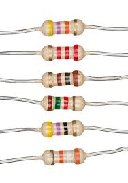
**ຄຳອະທິບາຍ:** ອຸປະກອນທີ່ຈຳກັດກະແສໄຟຟ້າ ມີຄ່າຄວາມຕ້ານທານວັດດ້ວຍ Ohms (Ω)

**Color Code Chart:**

```
Resistor Body:
┌─────────────────────┐
│ ████ ████ ████ ██   │ ← Color Bands
└─────────────────────┘
   1st  2nd  Mult. Tol.

ສີ        ຕົວເລກ    Multiplier
────────────────────────
ດຳ (Black)    0         x1
ນ້ຳຕານ (Brown) 1         x10
ແດງ (Red)     2         x100
ສົ້ມ (Orange) 3         x1K
ເຫຼືອງ (Yellow) 4      x10K
ເຂົ້າ (Green)  5        x100K
ຟ້າ (Blue)    6         x1M
ມ່ວງ (Violet) 7
ເທົາ (Gray)   8
ຂາວ (White)   9
ຄຳ (Gold)              ±5%
ເງິນ (Silver)           ±10%

ຕົວຢ່າງ 220Ω:
Red-Red-Brown-Gold = 2-2-x10 = 220Ω ±5%

ຕົວຢ່າງ 1KΩ (1000Ω):
Brown-Black-Red-Gold = 1-0-x100 = 1000Ω ±5%

ຕົວຢ່າງ 10KΩ (10000Ω):
Brown-Black-Orange-Gold = 1-0-x1000 = 10KΩ ±5%
```

**ໃນຊຸດມີ:**

- **220Ω:** ສຳລັບ LED (ຈຳກັດກະແສ ~20mA)
- **1KΩ:** ຈຳກັດກະແສປານກາງ, pull-down resistors
- **10KΩ:** Pull-up/pull-down resistors, voltage dividers

**ການເຮັດວຽກ:**

- ຕາມກົດໝາຍ Ohm: V = I × R
- ຫຼຸດແຮງດັນ ແລະ ຈຳກັດກະແສ
- ປ້ອງກັນອຸປະກອນເສຍຫາຍຈາກກະແສສູງເກີນ

**ຕົວຢ່າງການນຳໃຊ້:**

- ວົງຈອນ LED (220Ω)
- Pull-up/Pull-down ສຳລັບປຸ່ມກົດ (10KΩ)
- Voltage divider ສຳລັບເຊັນເຊີ

---

## 11. Push Buttons (ປຸ່ມກົດ)

**ຄຳອະທິບາຍ:** ສະວິດກົດຊົ່ວຄາວ (momentary switch) 4 pins ສຳລັບ input

**Schematic & Pinout:**

```
Top View:              Side View:          Circuit:
  ┌───────┐              ┌──┐
  │ 1   2 │              │  │ ← Button Cap
  │       │ <-Button     │██│
  │ 3   4 │              └──┘           5V
  └───────┘                │               │
                           └──Contact     ┌─┴─┐
Internal Connection:                      │   │ 10KΩ
When NOT pressed:         When Pressed:   │   │ Pull-down
1 ━━━ 2                   1 ━━━━━━━ 2    └─┬─┘
                                           │
3 ━━━ 4                   3 ━━━━━━━ 4    ├──→ Arduino Pin
                                           │
Pin 1,2 ເຊື່ອມກັນ          All Connected   │
Pin 3,4 ເຊື່ອມກັນ                          GND

Standard Circuit:
5V ──┬── Button ── Arduino Pin ──┬── 10KΩ ── GND
     └── ເມື່ອກົດ: HIGH (5V)     └── Pull-down
         ບໍ່ກົດ: LOW (0V)
```

**ໃນຊຸດມີ:**

- **4x Push Buttons** ກັບ **Color Caps** (ຝາສີປິດປຸ່ມ)
- ຂະໜາດມາດຕະຖານ 12x12mm

**ການເຮັດວຽກ:**

- ເມື່ອບໍ່ກົດ: ວົງຈອນເປີດ (Open Circuit)
- ເມື່ອກົດ: ວົງຈອນປິດ (Closed Circuit)
- ຕ້ອງໃຊ້ pull-down ຫຼື pull-up resistor (10KΩ) ເພື່ອກຳນົດສະຖານະທີ່ຊັດເຈນ

**ຄວາມແຕກຕ່າງ Pull-up vs Pull-down:**

```
Pull-down (ຖືກກວ່າ):
ບໍ່ກົດ → LOW (0V)
ກົດ → HIGH (5V)

Pull-up (ໃຊ້ internal resistor):
ບໍ່ກົດ → HIGH (5V)
ກົດ → LOW (0V)
```

**ຕົວຢ່າງການນຳໃຊ້:**

- ຄວບຄຸມ on/off ອຸປະກອນ
- ເມນູນຳທາງ (ຂຶ້ນ, ລົງ, ຢືນຢັນ, ຍົກເລີກ)
- ຖ້ານັບຈຳນວນຄັ້ງທີ່ກົດ (counter)

---

## 12. Potentiometer 5KΩ (ຕົວປັບຄ່າຕົວແປ)
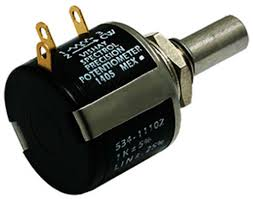
**ຄຳອະທິບາຍ:** Variable resistor ທີ່ສາມາດປັບຄ່າໄດ້ດ້ວຍການໝຸນ (0Ω ຫາ 5000Ω)

**Pinout Diagram:**

```
Top View:                Side View:
    ┌────┐                  Knob
    │ ═══│← Shaft           ╱│╲
    └─┬┬┬┘                 ╱ │ ╲
      │││                 │  │  │
      123                 │  │  │← Shaft
    Pins                  └──┴──┘
                            │││
Pin 1: Terminal 1 (0Ω)     123
Pin 2: Wiper (Variable)
Pin 3: Terminal 2 (5KΩ)

Voltage Divider Circuit:
    5V
     │
    ┌┴┐ Pin 3
    │ │
    │ │ 5KΩ Potentiometer
    │ │
    ├─┤ Pin 2 (Wiper) ──→ Arduino Analog Pin (A0)
    │ │                    Output: 0V to 5V
    │ │
    └┬┘ Pin 1
     │
    GND

ເມື່ອໝຸນຊ້າຍສຸດ: 0V
ເມື່ອໝຸນຂວາສຸດ: 5V
ເມື່ອໝຸນກາງ: 2.5V
```

**ການເຮັດວຽກ:**

- ເປັນ voltage divider ທີ່ປັບຄ່າໄດ້
- ໝຸນປັບຕຳແໜ່ງ wiper ເຮັດໃຫ້ແຮງດັນອອກປ່ຽນ
- Arduino ອ່ານແຮງດັນນີ້ໂດຍ analogRead() ໄດ້ຄ່າ 0-1023

**ສູດຄິດໄລ່:**

```
Vout = Vin × (R2 / (R1 + R2))
ເມື່ອ R1 + R2 = 5KΩ ຄົງທີ
```


---

## 13. Active Buzzer (ຕົວສຽງແບບມີວົງຈອນ)
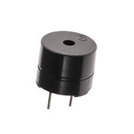
**ຄຳອະທິບາຍ:** Buzzer ທີ່ມີວົງຈອນ oscillator ພາຍໃນ ສົ່ງສຽງຄວາມຖີ່ຄົງທີ່ເມື່ອໃຫ້ໄຟ

**Schematic Diagram:**

```
Top View:              Side View:           Circuit:
   ┌───┐                 ┌───┐
   │ + │ ← Positive      │ + │ ← Sticker   Arduino Pin ──┐
   └───┘   Marking       │   │   (Red)                    │
                         │ ⊕ │              ┌───────────┐ │
Internal Circuit:       │   │              │  Active   │ │
  ┌─────────┐          │ - │              │  Buzzer   ├─┘
  │Oscillator│          └───┘              │           │
  │ Circuit  │                             └─────┬─────┘
  └─────────┘                                    │
      + -                                       GND

Pin Connection:
+ (Longer leg) → Arduino Digital Pin
- (Shorter leg) → GND

ເມື່ອໃຫ້ສັນຍານ HIGH (5V):
→ Buzzer ສົ່ງສຽງ "BEEP" ຄວາມຖີ່ຄົງທີ່ (~2000-4000Hz)

ເມື່ອໃຫ້ສັນຍານ LOW (0V):
→ Buzzer ງຽບ
```

**ຄຸນລັກສະນະ:**

- **ຄວາມຖີ່:** ຄົງທີ່ (ປະມານ 2-4 KHz)
- **ແຮງດັນ:** 3-12V DC
- **ກະແສ:** 20-30mA
- **ສຽງ:** ເສັ້ນດຽວ, ບໍ່ສາມາດປ່ຽນໂນດ

**ການເຮັດວຽກ:**

- ມີ oscillator circuit ພາຍໃນ
- ພຽງແຕ່ໃຫ້ໄຟ DC ກໍ່ສົ່ງສຽງອັດຕະໂນມັດ
- ບໍ່ຈຳເປັນຕ້ອງສົ່ງສັນຍານ PWM ຫຼື tone


```

**ຕົວຢ່າງການນຳໃຊ້:**
- ສັນຍານເຕືອນງ່າຍໆ (alarm, notification)
- ສຽງ BEEP ຢືນຢັນເມື່ອກົດປຸ່ມ
- Timer countdown beep
- ລະບົບເຕືອນໄພ (security alarm)
  
  
Top View:              Internal Structure:
   ┌───┐                ┌──────────┐
   │ - │ ← No marking   │          │
   └───┘   or sticker   │ ⊕        │ ← Piezo Element
                        │ Magnetic │   (No Oscillator)
Looks similar to       │ Coil     │
Active Buzzer but      └──────────┘
usually NO sticker         + -

Circuit with Tone Generation:
                  
Arduino PWM Pin ──→ Passive Buzzer (+) ──→ GND (-)
                      │
                 ສົ່ງສັນຍານຄວາມຖີ່
                 (50Hz - 20KHz)

Frequency Examples:
Note C4  → 261 Hz  ♪
Note E4  → 329 Hz  ♪
Note G4  → 392 Hz  ♪
Note A4  → 440 Hz  ♪
```

**ຄວາມແຕກຕ່າງຈາກ Active Buzzer:**
```
╔════════════╦══════════════╦═══════════════╗
║  Feature   ║   Active     ║   Passive     ║
╠════════════╬══════════════╬═══════════════╣
║ Oscillator ║ ມີພາຍໃນ      ║ ບໍ່ມີ          ║
║ Control    ║ ON/OFF       ║ Frequency     ║
║ Sound      ║ ຄວາມຖີ່ດຽວ   ║ ປ່ຽນໂນດໄດ້    ║
║ Code       ║ digitalWrite ║ tone()        ║
║ Sticker    ║ ມີຕິດເກືອບທຸກ ║ ປົກກະຕິບໍ່ມີ   ║
╚════════════╩══════════════╩═══════════════╝
// ງ່າຍຫຼາຍ - ພຽງເປີດ/ປິດ
digitalWrite(buzzerPin, HIGH); // ສຽງດັງ
delay(1000);
digitalWrite(buzzerPin, LOW);  // ງຽບ
```

**ຕົວຢ່າງການນຳໃຊ້:**
- ສັນຍານເຕືອນງ່າຍໆ (alarm, notification)
- ສຽງ BEEP ຢືນຢັນເມື່ອກົດປຸ່ມ
- Timer countdown beep
- ລະບົບເຕືອນໄພ (security alarm)

---

## 14. Passive Buzzer (ຕົວສຽງແບບບໍ່ມີວົງຈອນ)
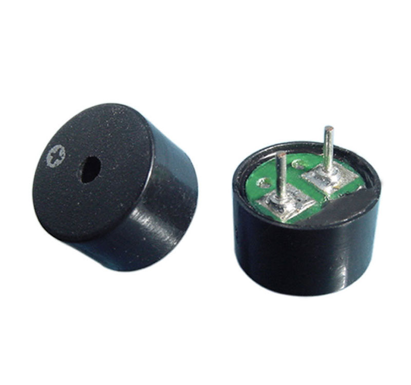
**ຄຳອະທິບາຍ:**
Buzzer ທີ່ບໍ່ມີວົງຈອນພາຍໃນ ຕ້ອງສົ່ງສັນຍານຄວາມຖີ່ຈາກ Arduino ເພື່ອສົ່ງສຽງ

**Schematic Diagram:**
```
Top View:              Internal Structure:
   ┌───┐                ┌──────────┐
   │ - │ ← No marking   │          │
   └───┘   or sticker   │ ⊕        │ ← Piezo Element
                        │ Magnetic │   (No Oscillator)
Looks similar to       │ Coil     │
Active Buzzer but      └──────────┘
usually NO sticker         + -

Circuit with Tone Generation:
                  
Arduino PWM Pin ──→ Passive Buzzer (+) ──→ GND (-)
                      │
                 ສົ່ງສັນຍານຄວາມຖີ່
                 (50Hz - 20KHz)

Frequency Examples:
Note C4  → 261 Hz  ♪
Note E4  → 329 Hz  ♪
Note G4  → 392 Hz  ♪
Note A4  → 440 Hz  ♪
```

**ຄວາມແຕກຕ່າງຈາກ Active Buzzer:**
```
╔════════════╦══════════════╦═══════════════╗
║  Feature   ║   Active     ║   Passive     ║
╠════════════╬══════════════╬═══════════════╣
║ Oscillator ║ ມີພາຍໃນ      ║ ບໍ່ມີ          ║
║ Control    ║ ON/OFF       ║ Frequency     ║
║ Sound      ║ ຄວາມຖີ່ດຽວ   ║ ປ່ຽນໂນດໄດ້    ║
║ Code       ║ digitalWrite ║ tone()        ║
║ Sticker    ║ ມີຕິດເກືອບທຸກ ║ ປົກກະຕິບໍ່ມີ   ║
╚════════════╩══════════════╩═══════════════╝
**ການເຮັດວຽກ:**

- ຕ້ອງມີສັນຍານ PWM ຄວາມຖີ່ສະເພາະ
- Arduino ສົ່ງ square wave ດ້ວຍຄວາມຖີ່ທີ່ຕ້ອງການ
- Piezo element ສັ່ນຕາມຄວາມຖີ່ນັ້ນສົ່ງສຽງອອກມາ
// ຫຼິ້ນເພງງ່າຍໆ
tone(buzzerPin, 262, 500); // C note, 500ms
delay(500);
tone(buzzerPin, 330, 500); // E note
delay(500);
tone(buzzerPin, 392, 500); // G note
delay(500);
noTone(buzzerPin);
```

**ຕົວຢ່າງການນຳໃຊ້:**
- ຫຼິ້ນເພງ (music player)
- ສຽງເຕືອນຫຼາຍລະດັບ (ຄວາມຖີ່ຕ່າງກັນ)
- ລະບົບສຽງສັນຍານ Morse code
- Game sound effects (ສຽງຊະນະ, ສຽງແພ້)

---

## 15. 16x2 LCD Display (ຈໍສະແດງຜົນ LCD)
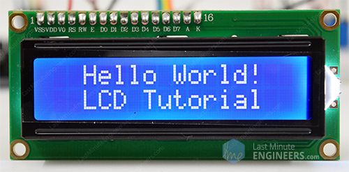
**ຄຳອະທິບາຍ:**
ຈໍສະແດງຜົນແບບຕົວອັກສອນ 16 ຖັນ x 2 ແຖວ (32 ຕົວອັກສອນທັງໝົດ)

**Pinout Diagram:**
```
LCD Module (16 pins):

Front View:                Back View (Pins):
┌────────────────────┐     
│ ┌──────────────┐   │     Pin  Name   Function
│ │ Hello World! │   │     ──────────────────────────
│ │ Arduino LCD  │   │     1    VSS    Ground (GND)
│ └──────────────┘   │     2    VDD    Power (+5V)
│   16x2 Characters  │     3    V0     Contrast (to POT)
└────┬┬┬┬┬┬┬┬┬┬┬┬┬┬┬┬┘     4    RS     Register Select
     ││││││││││││││││      5    RW     Read/Write (→GND)
     12345678901234 16     6    E      Enable
     │││││││││││││││ │     7    D0     Data bit 0 (not used)
     └┴┴┴┴┴┴┴┴┴┴┴┴┴┴┴┘     8    D1     Data bit 1 (not used)
                            9    D2     Data bit 2 (not used)
Pin Connections:            10   D3     Data bit 3 (not used)
VSS → GND                   11   D4     Data bit 4 (to Arduino)
VDD → 5V                    12   D5     Data bit 5 (to Arduino)
V0  → Potentiometer         13   D6     Data bit 6 (to Arduino)
RS  → Arduino Pin 12        14   D7     Data bit 7 (to Arduino)
RW  → GND                   15   A      Backlight + (to 5V)
E   → Arduino Pin 11        16   K      Backlight - (to GND)
D4  → Arduino Pin 5
D5  → Arduino Pin 4         4-bit Mode: ໃຊ້ພຽງ D4-D7
D6  → Arduino Pin 3         ປະຢັດ pins ຂອງ Arduino
D7  → Arduino Pin 2
A   → 5V (via 220Ω)
K   → GND
```

**ການເຮັດວຽກ:**
- **RS (Register Select):** 0=ຄຳສັ່ງ, 1=ຂໍ້ມູນ
- **E (Enable):** Pulse ເພື່ອອ່ານ/ຂຽນຂໍ້ມູນ
- **D4-D7:** ສົ່ງຂໍ້ມູນ 4-bit ຕໍ່ຄັ້ງ
- **V0:** ຄວບຄຸມ contrast (0V=ເຂັ້ມສຸດ, 5V=ຈາງສຸດ)

**Contrast Adjustment Circuit:**
```
5V ──┐
     │
    ┌┴┐
    │ │ 10KΩ Potentiometer
    │ │
    ├─┤──→ V0 (Pin 3 LCD)
    │ │     ໝຸນປັບຄວາມຊັດເຈນ
    └┬┘
     │
    GND
#include <LiquidCrystal.h>
LiquidCrystal lcd(12, 11, 5, 4, 3, 2); // RS,E,D4,D5,D6,D7

void setup() {
  lcd.begin(16, 2);          // ເລີ່ມ LCD 16x2
  lcd.print("Hello World!");  // ແຖວທີ 1
  lcd.setCursor(0, 1);       // ຍ້າຍໄປແຖວທີ 2
  lcd.print("Arduino LCD");
}
```

**ຕົວຢ່າງການນຳໃຊ້:**
- ສະແດງຄ່າເຊັນເຊີ (ອຸນຫະພູມ, ຄວາມຊື້ນ)
- ເມນູຕັ້ງຄ່າລະບົບ
- ໂຄງການນາຬິກາດິຈິຕອນ
- ຂໍ້ມູນ status ຂອງລະບົບ

---

## 16. I2C Serial Adapter Module (ໂມດູນແປງສັນຍານ I2C)
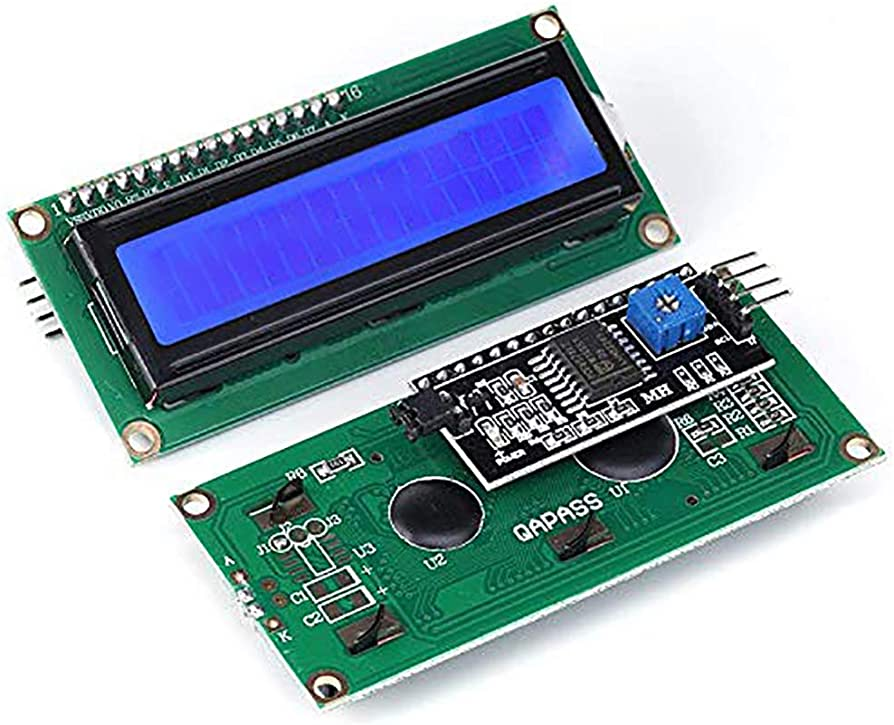
**ຄຳອະທິບາຍ:**
Module ທີ່ຕິດກັບ LCD ເພື່ອຫຼຸດການເຊື່ອມຕໍ່ຈາກ 16 pins ເຫຼືອພຽງ 4 pins (I2C)

**Pinout Diagram:**
```
I2C Adapter (ຕິດຫຼັງ LCD):

┌──────────────────┐
│  PCF8574 Chip    │← I2C Expander IC
│                  │
│  ┌─┐  ┌──────┐  │
│  │P│  │Jumper│  │← Backlight Control
│  └─┘  └──────┘  │
│                  │
│  SDA  SCL  VCC  GND │← 4 pins ພຽງພໍ!
└───┬───┬────┬────┬──┘
    │   │    │    │
    │   │    │    └──→ GND
    │   │    └───────→ 5V
    │   └────────────→ A5 (SCL) Arduino
    └────────────────→ A4 (SDA) Arduino

ຫຼັງຈາກຕິດກັບ LCD:
     ┌─────────────┐
     │   LCD 16x2  │
     │             │
     └──────┬──────┘
            │
     ┌──────┴──────┐
     │ I2C Adapter │
     └──┬──┬──┬──┬─┘
        │  │  │  │
      SDA SCL 5V GND

I2C Address (Default):
0x27 or 0x3F (ກວດສອບດ້ວຍ I2C Scanner)

Pin Mapping:
PCF8574 ──→ LCD
P0      ──→ RS
P1      ──→ RW
P2      ──→ E
P3      ──→ Backlight
P4-P7   ──→ D4-D7
```

**ຂໍ້ໄດ້ປຽບ:**
```
╔═══════════════╦══════════╦═════════╗
║    Feature    ║ ປົກກະຕິ   ║   I2C   ║
╠═══════════════╬══════════╬═════════╣
║ Pins ທີ່ໃຊ້    ║    16    ║    4    ║
║ Wiring        ║ ຊັບຊ້ອນ   ║ ງ່າຍ     ║
║ ປັບ Contrast  ║ ຕ້ອງ POT ║ Software║
║ ລາຄາ          ║ ຖືກກວ່າ   ║ ແພງກວ່າ  ║
╚═══════════════╩══════════╩═════════
#include <Wire.h>
#include <LiquidCrystal_I2C.h>

// ສ້າງ object: address 0x27, 16 cols, 2 rows
LiquidCrystal_I2C lcd(0x27, 16, 2);

void setup() {
  lcd.init();                    // ເລີ່ມ LCD
  lcd.backlight();               // ເປີດໄຟຫຼັງ
  lcd.print("I2C LCD!");
}
```

**ຕົວຢ່າງການນຳໃຊ້:**
- ໂຄງການທີ່ມີຫຼາຍ modules (ປະຢັດ pins)
- ລະບົບທີ່ມີຫຼາຍ LCD (ໃຊ້ address ຕ່າງກັນ)
- ງ່າຍຕໍ່ການຕິດຕັ້ງ ແລະ ບຳລຸງຮັກສາ

---

## 17. 7-Segment Display (Common Cathode)
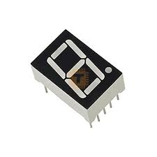
**ຄຳອະທິບາຍ:**
ຈໍສະແດງຕົວເລກ 1 ໜ່ວຍ ປະກອບດ້ວຍ LED 7 ເສັ້ນ (segments) + 1 ຈຸດທົດສະນິຍົມ

**Segment Layout & Pinout:**
```
Front View:              Segment Naming:
    ┌────┐                   ╔═══╗
    │ A  │                   ║ A ║
  ┌─┴────┴─┐               ╔═╝   ╚═╗
  │F      B│               ║F     B║
  ├────G───┤               ╠═══G═══╣
  │E      C│               ║E     C║
  └─┬────┬─┘               ╚═╗   ╔═╝
    │ D  │                   ║ D ║
    └────┘ •DP               ╚═══╝ •DP

Pin Configuration (Common Cathode):
       Top View
    ┌───────────┐
  ┌─┤  7-SEG   ├─┐
  │ └───────────┘ │
  1 2 3 4 5 6 7 8 9 10
  │ │ │ │ │ │ │ │ │ │
  e d c dp a b g f com

Pin  Segment   Connection
─────────────────────────────
1    E         Arduino Pin + R
2    D         Arduino Pin + R
3    C         Arduino Pin + R
4    DP (dot)  Arduino Pin + R
5    A         Arduino Pin + R
6    B         Arduino Pin + R
7    G         Arduino Pin + R
8    F         Arduino Pin + R
9-10 COM       GND (Common Cathode)

R = 220Ω resistor ແຕ່ລະ segment
```

**Truth Table (ຕົວເລກ 0-9):**
```
Number │ A B C D E F G │ Hex
───────┼───────────────┼─────
  0    │ 1 1 1 1 1 1 0 │ 0x3F
  1    │ 0 1 1 0 0 0 0 │ 0x06
  2    │ 1 1 0 1 1 0 1 │ 0x5B
  3    │ 1 1 1 1 0 0 1 │ 0x4F
  4    │ 0 1 1 0 0 1 1 │ 0x66
  5    │ 1 0 1 1 0 1 1 │ 0x6D
  6    │ 1 0 1 1 1 1 1 │ 0x7D
  7    │ 1 1 1 0 0 0 0 │ 0x07
  8    │ 1 1 1 1 1 1 1 │ 0x7F
  9    │ 1 1 1 1 0 1 1 │ 0x6F

1 = LED ເປີດ, 0 = LED ປິດ
// Digit patterns (ບິດ 0 = A, ບິດ 6 = G)
byte digits[10] = {
  0x3F, // 0
  0x06, // 1
  0x5B, // 2
  // ... etc
};

void displayDigit(int num) {
  byte pattern = digits[num];
  for(int i=0; i<7; i++) {
    digitalWrite(segPins[i], bitRead(pattern, i));
  }
}
```

**ຕົວຢ່າງການນຳໃຊ້:**
- ສະແດງເລກ counter (0-9)
- ສະແດງອຸນຫະພູມ (ເລກດຽວ)
- Timer countdown
- Score display ໃນເກມ

---

## 18. 4-Digit 7-Segment Display
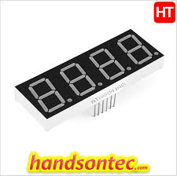
**ຄຳອະທິບາຍ:**
7-Segment Display 4 ໜ່ວຍຮ່ວມກັນ ສະແດງຕົວເລກ 0000-9999

**Pinout Diagram:**
```
Front View:
┌─────────────────────┐
│ ╔═══╗ ╔═══╗ ╔═══╗ ╔═══╗ │
│ ║ 8 ║ ║ 8 ║•║ 8 ║ ║ 8 ║•│
│ ╚═══╝ ╚═══╝ ╚═══╝ ╚═══╝ │
└─────────────────────┘
  Digit1 Digit2 Digit3 Digit4

Pin Configuration (12 pins):
    ┌───────────┐
    │  4-Digit  │
    │  Display  │
    └───────────┘
     123456789012
     │││││││││││││
Segments: A B C D E F G DP (8 pins)
Digits:   D1 D2 D3 D4 (4 pins - Common Cathode)

Multiplexing Strategy:
Time    │ Active Digit │ Display
────────┼──────────────┼─────────
0-5ms   │ D1 = LOW     │ Shows "8"
5-10ms  │ D2 = LOW     │ Shows "2"
10-15ms │ D3 = LOW     │ Shows "3"
15-20ms │ D4 = LOW     │ Shows "4"
→ Repeat

Result: ຕາມັນນວຍເຫັນ "8234" ເນື່ອງຈາກລວດໄວ!

Circuit Connection:
Segment pins (A-G, DP) → Arduino pins (+ 220Ω resistors)
Digit pins (D1-D4)     → Arduino pins (direct, no resistor)
```

**ການເຮັດວຽກ (Multiplexing):**
```
ຫຼັກການ POV (Persistence of Vision):
                                
Cycle 1: D1=ON,  D2=OFF, D3=OFF, D4=OFF → Show "8___"
Cycle 2: D1=OFF, D2=ON,  D3=OFF, D4=OFF → Show "_2__"
Cycle 3: D1=OFF, D2=OFF, D3=ON,  D4=OFF → Show "__3_"
Cycle 4: D1=OFF, D2=OFF, D3=OFF, D4=ON  → Show "___4"

ຖ້າວົນຮອບໄວກວ່າ 50Hz (20ms) → ຕາມັນນວຍເຫັນເປັນ "8234"
void displayNumber(int num) {
  int digits[4];
  digits[0] = num / 1000;       // Thousands
  digits[1] = (num / 100) % 10; // Hundreds
  digits[2] = (num / 10) % 10;  // Tens
  digits[3] = num % 10;         // Ones
  
  for(int d=0; d<4; d++) {
    digitalWrite(digitPins[d], LOW); // ເປີດ digit ນີ້
    displayDigit(digits[d]);         // ສະແດງຕົວເລກ
    delay(5);                        // 5ms
    digitalWrite(digitPins[d], HIGH);// ປິດ digit ນີ້
  }
}
```

**ຕົວຢ່າງການນຳໃຊ້:**
- ໂມງດິຈິຕອນ (12:34)
- ເຄື່ອງວັດອຸນຫະພູມ (25.6°C)
- Stopwatch/Timer (00:59)
- Counter ໂຄງການ (0-9999)

---

## 19. 8x8 Dot Matrix Display
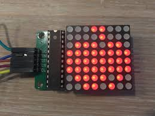
**ຄຳອະທິບາຍ:**
ຈໍສະແດງຜົນແບບ matrix LED 8 ແຖວ x 8 ຖັນ = 64 LED
Front View (8x8 LEDs):
┌─────────────────┐
│ ● ● ● ● ● ● ● ● │ ← Row 1
│ ● ● ● ● ● ● ● ● │ ← Row 2
│ ● ● ● ● ● ● ● ● │ ← Row 3
│ ● ● ● ● ● ● ● ● │ ← Row 4
│ ● ● ● ● ● ● ● ● │ ← Row 5
│ ● ● ● ● ● ● ● ● │ ← Row 6
│ ● ● ● ● ● ● ● ● │ ← Row 7
│ ● ● ● ● ● ● ● ● │ ← Row 8
└─────────────────┘
  ↑ ↑ ↑ ↑ ↑ ↑ ↑ ↑
  C1 C2 C3 C4 C5 C6 C7 C8
  Columns

Pinout (16 pins):
    ┌───────────┐
  ┌─┤  Matrix  ├─┐
  │ └───────────┘ │
  1 2 3 4 5 6 7 8 9 10 11 12 13 14 15 16

Pins 1-8:   Row pins (Cathode -)
Pins 9-16:  Column pins (Anode +)

Internal Structure (ແຕ່ລະ LED):
       Col1  Col2  Col3 ... Col8
       │     │     │       │
Row1 ──┤>LED ┤>LED ┤>LED...┤>LED
Row2 ──┤>LED ┤>LED ┤>LED...┤>LED
Row3 ──┤>LED ┤>LED ┤>LED...┤>LED
...
Row8 ──┤>LED ┤>LED ┤>LED...┤>LED

Multiplexing Timing:
Time  │ Active Row │ Column Data    │ Display
──────┼────────────┼────────────────┼─────────
0ms   │ Row 1=LOW  │ 00111100       │ ████░░░░
1ms   │ Row 2=LOW  │ 01000010       │ ░██░░░█░
2ms   │ Row 3=LOW  │ 10100101       │ █░█░░█░█
3ms   │ Row 4=LOW  │ 10000001       │ █░░░░░░█
...
→ Repeat cycle every 8ms → 125Hz refresh rate
**ການເຮັດວຽກ:**

- **Multiplexing:** ເປີດທີລະ row, ຄວບຄຸມ columns ເພື່ອສະແດງ pattern
- ວົນຮອບໄວ (>50Hz) ເຮັດໃຫ້ຕາມັນນວຍເຫັນພາບຄົງທີ່
- ປະຢັດ Arduino pins ແລະ ກະແສໄຟ

**ຕົວຢ່າງ Pattern (Smiley Face):**

```
byte smiley[8] = {
  B00111100,  // ░░████░░
  B01000010,  // ░█░░░░█░
  B10100101,  // █░█░░█░█
  B10000001,  // █░░░░░░█
  B10100101,  // █░█░░█░█
  B10011001,  // █░░██░░█
  B01000010,  // ░█░░░░█░
  B00111100   // ░░████░░
};
```
## 20. Temperature and Humidity Sensor (DHT11)

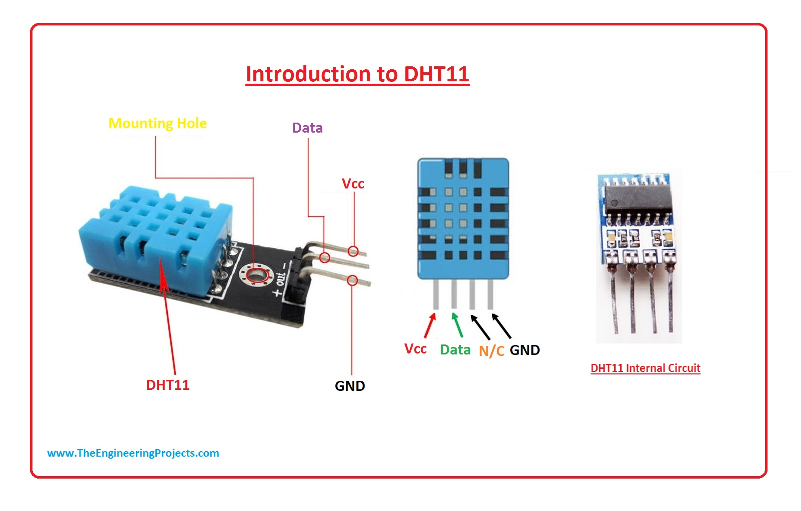

### 1) ແມ່ນຫຍັງ

DHT11 ແມ່ນ Sensor ສຳລັບວັດ

- ອຸນຫະພູມ (Temperature)
-  ຄວາມຊຸ່ມຊື່ນ (Humidity)
ເປັນ sensor ແບບ **Digital** ມີ Microcontroller ຢູ່ພາຍໃນ
### 2) ການເຮັດວຽກ

- ພາຍໃນມີ thermistor + humidity capacitor
- ປະມວນຜົນແລ້ວສົ່ງຂໍ້ມູນອອກທາງ **DATA pin (single-wire)**
- Arduino ອ່ານຄ່າໂດຍ library DHT
### 3) Pinout

|Pin|ຄວາມຫມາຍ|
|---|---|
|VCC|3.3–5V|
|DATA|ສົ່ງຂໍ້ມູນ|
|NC|ບໍ່ໃຊ້|
|GND|Ground|

### 🔧 ຕົວຢ່າງ

- Smart Greenhouse
- ຈໍສະແດງອຸນຫະພູມໃນ LCD

---

##  21. LM35 Temperature Sensor


### 1) ແມ່ນຫຍັງ

LM35 ແມ່ນ Sensor ວັດອຸນຫະພູມແບບ **Analog**

### 2) ການເຮັດວຽກ

- ປ່ອຍແຮງດັນ 10mV / 1°C
- Arduino ອ່ານຄ່າຈາກ Analog pin (A0)
### 3) Pinout

|Pin|ຄວາມຫມາຍ|
|---|---|
|VCC|5V|
|Vout|Analog Output|
|GND|Ground|

###  ຕົວຢ່າງ

- Digital Thermometer
- ຄວບຄຸມພັດລົມຕາມອຸນຫະພູມ
## 22. Tilt Sensor

### 1) ແມ່ນຫຍັງ

LM35 ແມ່ນ Sensor ວັດອຸນຫະພູມແບບ **Analog**

### 2) ການເຮັດວຽກ

- ປ່ອຍແຮງດັນ 10mV / 1°C
- Arduino ອ່ານຄ່າຈາກ Analog pin (A0)
### 3) Pinout

| Pin  | ຄວາມຫມາຍ      |
| ---- | ------------- |
| VCC  | 5V            |
| Vout | Analog Output |
| GND  | Ground        |

###  ຕົວຢ່າງ
- Digital Thermometer
- ຄວບຄຸມພັດລົມຕາມອຸນຫະພູມ
### 1) ແມ່ນຫຍັງ

Tilt Sensor ແມ່ນ sensor ກວດຈັບການເອຽງ / ການຫົວງ

### 2) ການເຮັດວຽກ

- ຂ້າງໃນມີລູກເຫຼັກນ້ອຍ
- ເມື່ອເອຽງ → circuit ປິດ/ເປີດ
- Arduino ອ່ານຄ່າ Digital HIGH / LOW

### 3) Pinout

| Pin   | ຄວາມຫມາຍ |
| ----- | -------- |
| Pin 1 | Signal   |
| Pin 2 | GND      |

### ຕົວຢ່າງ

- ເຕືອນຂອງຕົກ
- Anti-theft system

##  23. Photoresistor (LDR)


### 1) ແມ່ນຫຍັງ

LDR (Light Dependent Resistor) ແມ່ນຕົວຕ້ານທີ່ປ່ຽນຄ່າຕາມແສງ

### 2) ການເຮັດວຽກ

- ແສງຫຼາຍ → R ນ້ອຍ
- ແສງນ້ອຍ → R ຫຼາຍ
- ໃຊ້ຮ່ວມກັບ Voltage Divider
### 3) Pinout

- ບໍ່ມີ polarity (ສຽບຂ້າງໃດກໍໄດ້
### ຕົວຢ່າງ

- Auto Street Light
- Light meter

---

##  24. PIR Motion Sensor


### 1) ແມ່ນຫຍັງ

PIR Sensor ໃຊ້ກວດຈັບການເຄື່ອນໄຫວຂອງມະນຸດ
### 2) ການເຮັດວຽກ

- ກວດຈັບ Infrared ຈາກຮ່າງກາຍ
- ມີ Fresnel Lens ຊ່ວຍຂະຫຍາຍພື້ນທີ່
### 3) Pinout

|Pin|ຄວາມຫມາຍ|
|---|---|
|VCC|5V|
|OUT|Digital Output|
|GND|Ground|

### 🔧 ຕົວຢ່າງ

- Automatic Light
- Alarm System

---

## 25. Ultrasonic Module (HC-SR04)
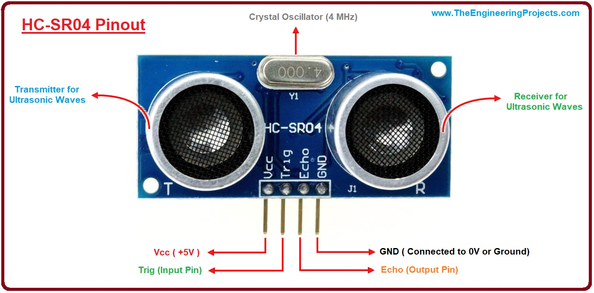
### 1) ແມ່ນຫຍັງ

Ultrasonic Sensor ແມ່ນ Sensor ວັດລະຍະທາງ
### 2) ການເຮັດວຽກ

- Trigger → ສົ່ງຄືນສຽງ 40kHz
- Echo → ຮັບສຽງກັບ    
- Distance = (Time × Speed of Sound) / 2
### 3) Pinout

|Pin|ຄວາມຫມາຍ|
|---|---|
|VCC|5V|
|Trig|Trigger|
|Echo|Echo|
|GND|Ground|

### 🔧 ຕົວຢ່າງ

- Smart Parking
- Robot Obstacle Avoidance
---

## 26. Sound Sensor (Microphone Module)


### 1) ແມ່ນຫຍັງ

Sound Sensor ແມ່ນ Sensor ກວດຈັບຄວາມດັງຂອງສຽງ ໂດຍໃຊ້ Microphone

### 2) ການເຮັດວຽກ

- Microphone ແປງສຽງ → ສັນຍານໄຟຟ້າ
- Amplifier ຂະຫຍາຍສັນຍານ
- Comparator ກຳນົດ Threshold

### 3) Pinout

|Pin|ໜ້າທີ່|
|---|---|
|VCC|5V|
|AO|Analog Output|
|DO|Digital Output|
|GND|Ground|

### 🔧 ຕົວຢ່າງ

- Clap Switch
- Sound Level Monitor

---

##  27. Water Sensor

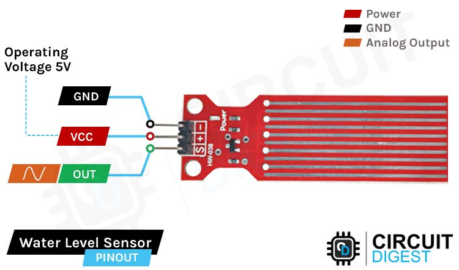

### 1) ແມ່ນຫຍັງ

Water Sensor ແມ່ນ Sensor ກວດຈັບ **ນ້ຳ ຫຼື ຄວາມຊຸ່ມ**

### 2) ການເຮັດວຽກ

- ນ້ຳເຊື່ອມລວດທອງແດງ
- Resistance ປ່ຽນ → Voltage ປ່ຽນ
- Arduino ອ່ານຄ່າ Analog

### 3) Pinout

|Pin|ໜ້າທີ່|
|---|---|
|VCC|3.3–5V|
|SIG|Analog Signal|
|GND|Ground|

###  ຕົວຢ່າງ

- Flood Alarm
- Smart Irrigation

---

##  28. Flame Sensor

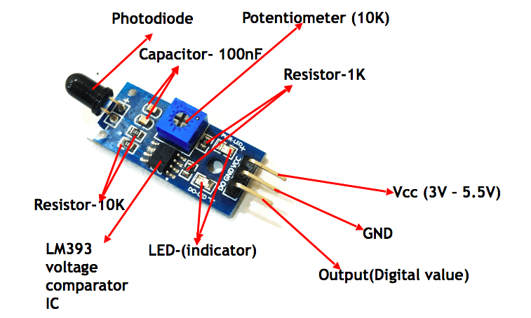

### 1) ແມ່ນຫຍັງ

Flame Sensor ແມ່ນ Sensor ກວດຈັບ **ແປວໄຟ** ດ້ວຍ Infrared

### 2) ການເຮັດວຽກ

- Flame ປ່ອຍ IR (760–1100nm)
- Sensor ຮັບ IR
- Comparator ສົ່ງ Digital Signal

### 3) Pinout

|Pin|ໜ້າທີ່|
|---|---|
|VCC|5V|
|DO|Digital Output|
|AO|Analog Output|
|GND|Ground|

###  ຕົວຢ່າງ

- Fire Alarm
- Fire Fighting Robot

---

## 29. RFID Module (RC522)

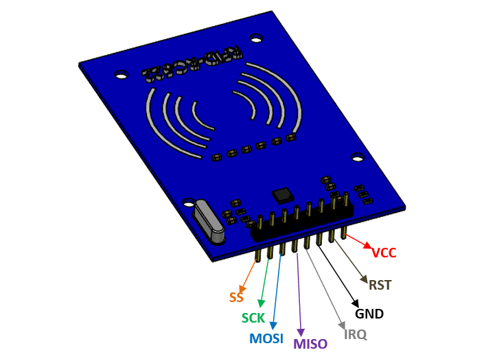


### 1) ແມ່ນຫຍັງ

RFID Module ແມ່ນອຸປະກອນອ່ານຂໍ້ມູນຈາກ RFID Tag ແບບ **Contactless**

### 2) ການເຮັດວຽກ

- Module ສ້າງສະໜາມແມ່ເຫຼັກ
- Tag ຕອບກັບ UID
- Arduino ຮັບຂໍ້ມູນຜ່ານ SPI

### 3) Pinout (SPI)

|Pin|ໜ້າທີ່|
|---|---|
|SDA|SS|
|SCK|Clock|
|MOSI|Data Out|
|MISO|Data In|
|IRQ|Interrupt|
|GND|Ground|
|RST|Reset|
|3.3V|Power|

###  ຕົວຢ່າງ

- Access Control
- Attendance System

---

## 30. RFID Tag


### 1) ແມ່ນຫຍັງ

RFID Tag ແມ່ນບັດຫຼື Keychain ທີ່ມີ UID ແລະ IC

### 2) ການເຮັດວຽກ

- ຮັບພະລັງງານຈາກ RFID Reader
- ສົ່ງ UID ກັບໄປ

### 3) ອົງປະກອບ

- Antenna Coil
- Memory IC
###  ຕົວຢ່າງ

- Keycard
- Student ID

---

## 🔹 31. Infrared Receiver (IR Receiver)


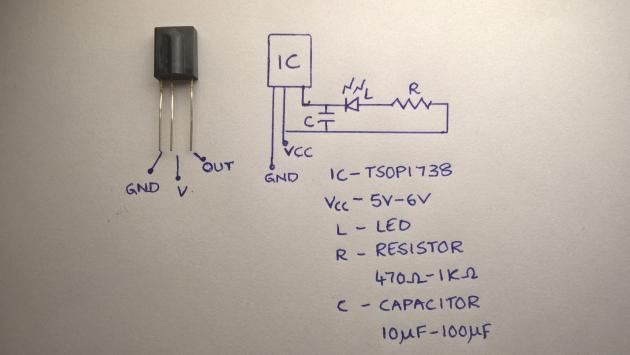

### 1) ແມ່ນຫຍັງ

IR Receiver ແມ່ນ Sensor ຮັບສັນຍານ Infrared (38kHz)

### 2) ການເຮັດວຽກ

- ຮັບ IR Pulse
- Demodulator ແປງເປັນ Digital Signal

### 3) Pinout

|Pin|ໜ້າທີ່|
|---|---|
|OUT|Data|
|GND|Ground|
|VCC|5V|

###  ຕົວຢ່າງ

- Remote Control System
- Home Automation

---

##  32. Infrared Remote Control

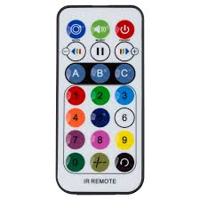

### 1) ແມ່ນຫຍັງ

IR Remote ແມ່ນອຸປະກອນສົ່ງຄຳສັ່ງ Infrared

### 2) ການເຮັດວຽກ

- Button → Encode (NEC Protocol)
- IR LED ສົ່ງ Pulse 38kHz


### 3) ອົງປະກອບ

- IR LED
- Encoder IC

###  ຕົວຢ່າງ

- Wireless Control
- Menu Navigation

---

## 🔹 33. Joystick Module

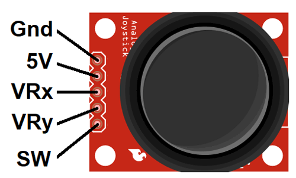
### 1) ແມ່ນຫຍັງ

Joystick Module ແມ່ນ Input Device ສອງແກນ (X,Y) + Switch

### 2) ການເຮັດວຽກ

- X,Y ເປັນ Potentiometer
- ການກົດ → Digital Signal

### 3) Pinout

|Pin|ໜ້າທີ່|
|---|---|
|VCC|5V|
|VRx|X-axis|
|VRy|Y-axis|
|SW|Switch|
|GND|Ground|

###  ຕົວຢ່າງ

- Robot Control
- Game Controller
## 34. Relay Module
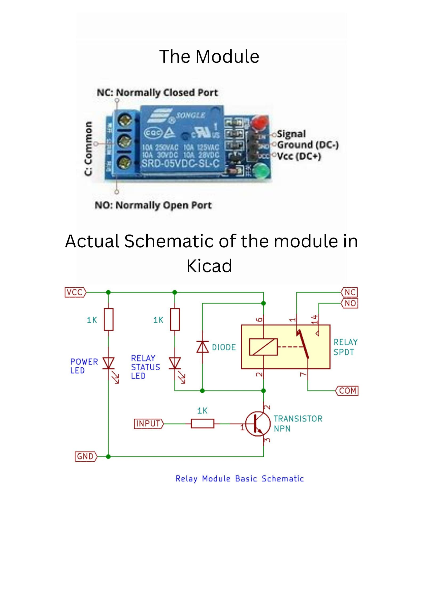

**ແມ່ນຫຍັງ?**  
Relay Module ແມ່ນອຸປະກອນສະຫຼັບວົງຈອນໄຟຟ້າ ໂດຍໃຊ້ສັນຍານຄວບຄຸມແຮງດັນຕ່ຳ (5V)

**ການໃຊ້ງານ**  
Microcontroller ສົ່ງສັນຍານໄປກະຕຸ້ນ Coil → ສະຫຼັບ NO/NC → ຄວບຄຸມອຸປະກອນ 220V

**ພາກສ່ວນສຳຄັນ**

- VCC, GND, IN
- COM, NO, NC
    

---

## 35. DC Motor

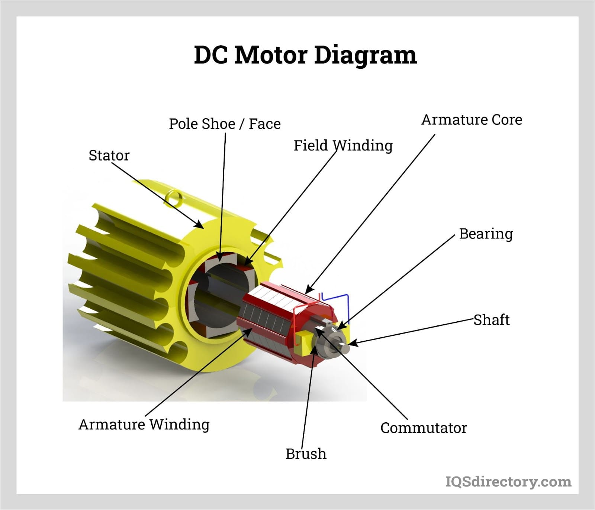
**ແມ່ນຫຍັງ?**  
ມໍເຕີໄຟຟ້າກະແສກົງ ແປງພະລັງງານໄຟຟ້າເປັນການໝຸນ

**ການໃຊ້ງານ**  
ຈ່າຍໄຟ → ແກນໝຸນ → ປ່ຽນທິດທາງໂດຍກັບຂົນາດຂອງຂົນາດ

---

## 36. Servo Motor

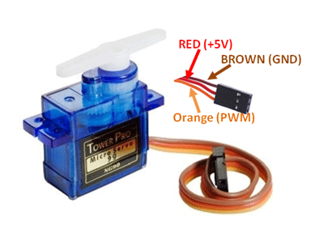
**ແມ່ນຫຍັງ?**  
ມໍເຕີທີ່ຄວບຄຸມມຸມໝຸນໄດ້ຢ່າງແມ່ນຍຳ

**ການໃຊ້ງານ**  
PWM Signal → Control Circuit → Motor + Gear

**PIN**

- GND (Brown)
    
- VCC (Red)
    
- Signal (Yellow)
    

---

## 37. Stepper Motor


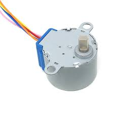
**ແມ່ນຫຍັງ?**  
ມໍເຕີທີ່ໝຸນເປັນຂັ້ນ (Step)

**ການໃຊ້ງານ**  
Pulse Signal → ໝຸນທີລະ Step → ຄວບຄຸມຕຳແໜ່ງໄດ້ສູງ

---

## 38. Motor Driver Module (L298N)


**ແມ່ນຫຍັງ?**  
ວົງຈອນຂັບມໍເຕີ DC / Stepper

**ການໃຊ້ງານ**  
Microcontroller → L298N → Motor

**PIN ສຳຄັນ**

- IN1–IN4
    
- ENA / ENB
    
- 12V, GND
    

---

## 39. Real-Time Clock (RTC) Module **DS1302**

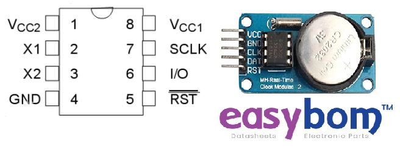
### 1) ແມ່ນຫຍັງ?

**DS1302** ແມ່ນ Real-Time Clock (RTC) IC ທີ່ໃຊ້ເກັບຮັກສາເວລາຈິງ (ວັນ-ເດືອນ-ປີ, ຊົ່ວໂມງ-ນາທີ-ວິນາທີ) ແລະສາມາດນັບເວລາຕໍ່ໄປໄດ້ແມ່ນແຕ່ຕັດໄຟຫຼັກ ໂດຍໃຊ້ **Battery Backup** (ຖ່ານ CR2032)

---

### 2) ການໃຊ້ງານແລະຫຼັກການເຮັດວຽກ

- Microcontroller (Arduino/ESP/MCU) ສື່ສານກັບ DS1302 ຜ່ານ **3-Wire Serial Interface**
    
- ໃຊ້ **Crystal 32.768 kHz** ເພື່ອຄວາມແມ່ນຍຳຂອງເວລາ
    
- ເມື່ອໄຟຫຼັກຖືກຕັດ → ຖ່ານ Backup ຈ່າຍໄຟໃຫ້ RTC ດຳເນີນຕໍ່
    
- ມີ **RAM 31 bytes** ໃຫ້ເກັບຂໍ້ມູນນ້ອຍໆ (ຄ່າ setting)
    

---

### 3) PINOUT ແລະອະທິບາຍແຕ່ລະຂາ

|PIN|ຊື່|ອະທິບາຍ|
|---|---|---|
|VCC|Power|5V / 3.3V (ຂຶ້ນກັບ module)|
|GND|Ground|ກາວດິນ|
|CLK|Clock|ສັນຍານນາລິກາ Serial|
|DAT|Data|ສົ່ງ-ຮັບຂໍ້ມູນ|
|RST|Reset / CE|Enable ການສື່ສານ|
|VBAT|Battery|ຖ່ານ CR2032|

---

### 4) ສ່ວນປະກອບສຳຄັນໃນ Module

- **DS1302 IC** – ຄວບຄຸມເວລາ
    
- **Crystal 32.768 kHz** – ຄວາມແມ່ນຍຳເວລາ
    
- **CR2032 Holder** – Battery Backup
    
- **Pull-up Resistors** – ສະໜັບສະໜູນສັນຍານ Serial
    

---

### 5) ຕົວຢ່າງການນຳໃຊ້

- ນາລິກາດິຈິຕອນ
    
-  Data Logger (ບັນທຶກເວລາ)
    
- ລະບົບຄວບຄຸມເວລາເປີດ-ປິດ
    
-  Automation / IoT

---

### 6) ຈຸດເດັ່ນ & ຂໍ້ຈຳກັດ

**ຂໍ້ດີ**

- ຖືກ ແລະ ໃຊ້ງ່າຍ
    
- Battery Backup
    
- RAM ໃນຕົວ
    

**ຂໍ້ຈຳກັດ**

- ຄວາມແມ່ນຍຳນ້ອຍກວ່າ DS3231
    
- ບໍ່ໃຊ້ I2C (ເປັນ 3-Wire)
---

## 40. Power Supply Module (Breadboard Power)

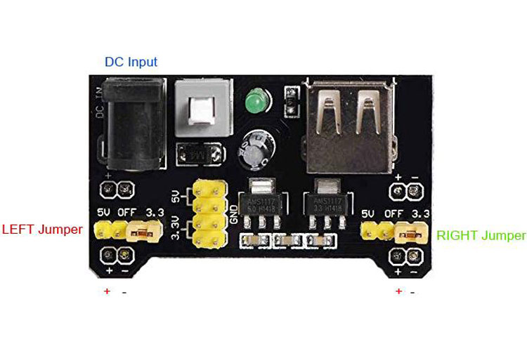

**ແມ່ນຫຍັງ?**  
ແຫຼ່ງຈ່າຍໄຟ 3.3V / 5V ສຳລັບ Breadboard

**ການໃຊ້ງານ**  
Adapter / USB → Regulator → Output Rail

**ສ່ວນປະກອບ**

- AMS1117
- Jumper Selector
- ON/OFF Switch


