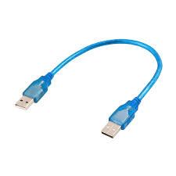
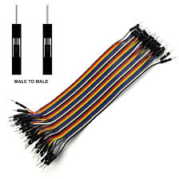
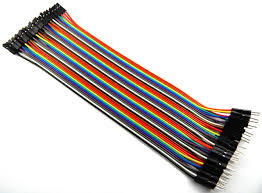
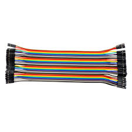
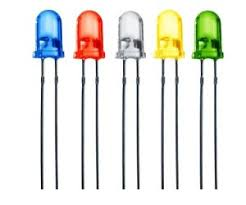
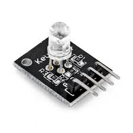
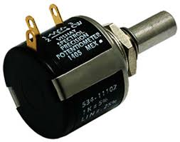
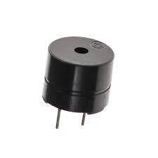

## **1. Arduino Uno Board**


**ຄຳອະທິບາຍ:** Arduino Uno ແມ່ນ microcontroller board ທີ່ອີງໃສ່ ATmega328P chip ເປັນສະໝອງກາງຂອງໂຄງການທັງໝົດ

**Schematic Diagram:**

```
        USB Port
          │
    ┌─────┴─────┐
    │  ARDUINO  │
    │    UNO    │
    │           │
 ┌──┤ ATmega328│──┐
 │  │           │  │
 │  └───────────┘  │
 │                 │
Digital Pins     Analog Pins
(0-13)           (A0-A5)
 │                 │
GND  5V  3.3V   GND  AREF
```

**ສ່ວນປະກອບສຳຄັນ:**

- **ATmega328P Microcontroller:** ໂປຣເຊດເຊີ 8-bit, 16MHz
- **Digital I/O Pins (0-13):** 14 pins (6 pins ສາມາດໃຊ້ PWM)
- **Analog Input Pins (A0-A5):** 6 pins ອ່ານຄ່າແບບ analog
- **Power Pins:** VIN, 5V, 3.3V, GND
- **Reset Button:** ກົດເພື່ອ restart ໂປແກຼມ
- **USB Port:** ສຳລັບອັບໂຫຼດໂປແກຼມ ແລະ ສະໜອງໄຟ
- **DC Power Jack:** ຮັບໄຟ 7-12V

**ການເຮັດວຽກ:**

- ຮັບໂປແກຼມຈາກຄອມພິວເຕີຜ່ານ USB
- ປະມວນຜົນຄຳສັ່ງຕາມໂປແກຼມທີ່ອັບໂຫຼດ
- ຄວບຄຸມ input/output ກັບເຊັນເຊີ ແລະ actuators

**ຕົວຢ່າງການນຳໃຊ້:**

- ສ້າງລະບົບຄວບຄຸມອຸນຫະພູມອັດຕະໂນມັດ
- ພັດທະນາ robot ຫຼິ້ນເດັກ
- IoT projects ເຊື່ອມຕໍ່ອິນເຕີເນັດ

---

## 2. Breadboard (ແຜ່ນທົດລອງ)

**ຄຳອະທິບາຍ:** Breadboard ແມ່ນແຜ່ນທົດລອງທີ່ບໍ່ຕ້ອງບັດກີ່ ໃຊ້ສຳລັບຕໍ່ວົງຈອນຊົ່ວຄາວ

**Schematic Diagram:**

```
Power Rails (ແຖວໄຟ)
+ ━━━━━━━━━━━━━━━━━ (ສີແດງ)
- ━━━━━━━━━━━━━━━━━ (ສີດຳ/ສີຟ້າ)

Terminal Strips (ແຖວຕໍ່ອຸປະກອນ)
a  ● ● ● ● ● ... ●
b  ● ● ● ● ● ... ●
c  ● ● ● ● ● ... ●
d  ● ● ● ● ● ... ●
e  ● ● ● ● ● ... ●
   ═══════════════ (ຊ່ອງກາງ)
f  ● ● ● ● ● ... ●
g  ● ● ● ● ● ... ●
h  ● ● ● ● ● ... ●
i  ● ● ● ● ● ... ●
j  ● ● ● ● ● ... ●

- ━━━━━━━━━━━━━━━━━
+ ━━━━━━━━━━━━━━━━━
```

**ສ່ວນປະກອບ:**

- **Power Rails:** ແຖວແນວຕັ້ງເຊື່ອມຕໍ່ກັນທັງໝົດ (+5V, GND)
- **Terminal Strips:** ແຖວແນວນອນ (a-j) ແຕ່ລະຄໍລຳມີ 5 ຮູເຊື່ອມຕໍ່ກັນ
- **Center Gap:** ຊ່ອງກາງສຳລັບສອດ IC chips

**ການເຮັດວຽກ:**

- ຂາອຸປະກອນທີ່ສອດລົງໃນແຖວດຽວກັນຈະເຊື່ອມຕໍ່ກັນໂດຍອັດຕະໂນມັດ
- ບໍ່ຕ້ອງບັດກີ່ ສາມາດປ່ຽນແປງວົງຈອນໄດ້ງ່າຍ

**ຕົວຢ່າງການນຳໃຊ້:**

- ທົດສອບວົງຈອນໄຟຟ້າກ່ອນບັດກີ່ຖາວອນ
- ສ້າງ prototype ໂປຣເຈັກ Arduino
- ສອນນັກຮຽນກ່ຽວກັບວົງຈອນໄຟຟ້າ

---

## 3. USB Cable (ສາຍ USB)

**ຄຳອະທິບາຍ:** ສາຍ USB Type A ຫາ Type B ສຳລັບເຊື່ອມຕໍ່ Arduino ກັບຄອມພິວເຕີ

**Pinout Diagram:**

```
USB Type A (ຄອມພິວເຕີ)    USB Type B (Arduino)
    ┌───────┐              ┌─────────┐
    │ ┌───┐ │              │  ┌───┐  │
    │ │ ▪ │ │              │  │ │ │  │
    │ │ ▪ │ │              │  │ │ │  │
    │ │ ▪ │ │              │  │ │ │  │
    │ │ ▪ │ │              │  │ │ │  │
    │ └───┘ │              │  └───┘  │
    └───────┘              └─────────┘
    
Pin Functions:
1. VCC  (+5V power)
2. D-   (Data negative)
3. D+   (Data positive)
4. GND  (Ground)
```

**ການເຮັດວຽກ:**

- ສົ່ງກະແສໄຟ 5V ຫາ Arduino (ສູງສຸດ 500mA)
- ສື່ສານຂໍ້ມູນແບບ serial ເພື່ອອັບໂຫຼດໂປແກຼມ
- ສົ່ງຂໍ້ມູນ debug ກັບຄືນມາຄອມພິວເຕີ

**ຕົວຢ່າງການນຳໃຊ້:**

- ອັບໂຫຼດ sketch ຈາກ Arduino IDE
- ສະແດງຜົນການຕິດຕາມ (Serial Monitor)
- ສະໜອງໄຟໃຫ້ໂຄງການຂະໜາດນ້ອຍ

---

## 4-6. Jumper Wires (ສາຍຈັ໊ມເປີ)

**ຄຳອະທິບາຍ:** ສາຍເຊື່ອມຕໍ່ທີ່ມີຫົວຕໍ່ 3 ປະເພດ

**ປະເພດສາຍ:**

```
Male-to-Male (M-M):    Male-to-Female (M-F):   Female-to-Female (F-F):
  ▬▬▬▬▬                  ▬▬▬▬▬                    ▬▬▬▬▬
  ╪    ╪                 ╪    ║                   ║    ║
  Pin  Pin               Pin  Socket              Socket Socket
```

**4. Male-to-Male:**

- ໃຊ້ບົນ breadboard
- ເຊື່ອມຕໍ່ຈຸດຕ່າງໆ ໃນ breadboard

**5. Male-to-Female:**

- ເຊື່ອມ Arduino pin ຫາ breadboard
- ເຊື່ອມ sensor module ຫາ breadboard

**6. Female-to-Female:**

- ເຊື່ອມ module ທີ່ມີ male header ເຂົ້າກັນ
- ເຊື່ອມ Arduino male pins ຫາ sensor modules

**ການເຮັດວຽກ:**

- ນຳສັນຍານໄຟຟ້າ (digital/analog) ລະຫວ່າງອຸປະກອນ
- ມີສີຕ່າງໆ ເພື່ອຈຳແນກສາຍ (ແດງ=ໄຟບວກ, ດຳ=GND, ອື່ນໆ=signal)

**ຕົວຢ່າງການນຳໃຊ້:**

- ເຊື່ອມ LED ຫາ Arduino ຜ່ານ breadboard
- ສ້າງວົງຈອນທົດສອບໂດຍບໍ່ຕ້ອງບັດກີ່
- ຂະຫຍາຍການເຊື່ອມຕໍ່ໄປຫາເຊັນເຊີຫ່າງໄກ

---

## 7. 9V Battery Connector (ຫົວຕໍ່ຖ່ານ 9V)

**ຄຳອະທິບາຍ:** Connector ສຳລັບຖ່ານ 9V ເຂົ້າກັບ Arduino ເພື່ອໃຊ້ງານແບບພົກພາ

**Schematic:**

```
Battery (9V):          Connector:        To Arduino:
    ┌─────┐               ╔═══╗            ┌──────┐
    │  +  │───Red Wire────║ + ║────────────│ VIN  │
    │ ═══ │               ║   ║            │      │
    │  -  │──Black Wire───║ - ║────────────│ GND  │
    └─────┘               ╚═══╝            └──────┘
     
Standard 9V Battery    DC Barrel Jack    Arduino Power In
(PP3 Type)            (2.1mm center +)
```

**ສ່ວນປະກອບ:**

- **ຫົວຄລິບຖ່ານ:** ຫົວຕໍ່ແບບ snap-on ສຳລັບຖ່ານ 9V
- **ສາຍແດງ (+):** ເຊື່ອມຫາ VIN ຂອງ Arduino
- **ສາຍດຳ (-):** ເຊື່ອມຫາ GND
- **DC Barrel Jack:** ສອດເຂົ້າຕຳແໜ່ງໄຟ Arduino

**ການເຮັດວຽກ:**

- Arduino ມີ voltage regulator ຫຼຸດ 9V ລົງເປັນ 5V
- ຮັບປະກັນວ່າ Arduino ແລະ circuits ຮັບໄຟ 5V ທີ່ຖືກຕ້ອງ
- ຖ່ານ 9V ໃຫ້ກະແສປະມານ 400-600mAh

**ຕົວຢ່າງການນຳໃຊ້:**

- ສ້າງ robot ທີ່ເຄື່ອນຍ້າຍໄດ້ໂດຍບໍ່ຕ້ອງສາຍໄຟ
- ໂຄງການ outdoor monitoring ທີ່ບໍ່ມີປ່ຽງໄຟ
- ອຸປະກອນພົກພາເຊັ່ນ: weather station

---

## 8. LEDs (ໄຟ LED)

**ຄຳອະທິບາຍ:** Light Emitting Diodes - ອຸປະກອນທີ່ປ່ຽນກະແສໄຟເປັນແສງສະຫວ່າງ

**Schematic & Pinout:**

```
Standard LED:           RGB LED (4-pin):
    
  Anode (+)              Common Cathode
     │                      │
    ╱│╲                  ┌──┴──┐
   ╱ │ ╲                 │  -  │ (longest)
  │  │  │                ├─────┤
   ╲ │ ╱                 │  R  │ Red
    ╲│╱                  ├─────┤
     │                   │  G  │ Green
  Cathode (-)            ├─────┤
  (shorter leg)          │  B  │ Blue
                         └─────┘

Circuit with Resistor:
Arduino Pin ──→ 220Ω ──→ LED+ ──→ LED- ──→ GND
```

**ໃນຊຸດມີ:**

- **5x Red LEDs** (ແສງແດງ) - 1.8-2.0V forward voltage
- **5x Yellow LEDs** (ແສງເຫຼືອງ) - 2.0-2.2V
- **5x Blue LEDs** (ແສງສີຟ້າ) - 3.0-3.4V
- **1x RGB LED** (ປ່ຽນສີໄດ້) - 3 ສີລວມກັນ

**ການເຮັດວຽກ:**

- ເມື່ອມີກະແສໄຟຜ່ານທິດທາງຖືກຕ້ອງ (anode → cathode) LED ຈະປ່ອຍແສງ
- **ຕ້ອງໃຊ້ resistor** ເພື່ອຈຳກັດກະແສ (ປົກກະຕິ 220Ω ກັບ 5V)
- RGB LED ສາມາດປະສົມສີໄດ້ໂດຍການຄວບຄຸມແຕ່ລະສີດ້ວຍ PWM

**ການຄິດໄລ່ Resistor:**

```
R = (Vs - Vf) / If
ຕົວຢ່າງ: R = (5V - 2V) / 0.02A = 150Ω (ໃຊ້ 220Ω ປອດໄພກວ່າ)
```

**ຕົວຢ່າງການນຳໃຊ້:**

- LED ກະພິບເປັນສັນຍານເຕືອນ
- ສະແດງສະຖານະຂອງລະບົບ (ສີເຂົ້າ, ສີເຫຼືອງ, ສີແດງ)
- ສ້າງໂຄງການສ່ອງສະຫວ່າງ ຫຼື ຕົບແຕ່ງ RGB

---

## 9. RGB Module

**ຄຳອະທິບາຍ:** Module RGB LED ທີ່ມີ resistors ພ້ອມນຳໃຊ້ງານ

**Pinout Diagram:**

```
RGB Module (Common Cathode):
    ┌──────────┐
    │   RGB    │
    │  ┌────┐  │
    │  │ ▓▓ │  │ ← LED RGB ພາຍໃນ
    │  └────┘  │
    │  R G B - │ ← 4 pins
    └──┬─┬─┬─┬─┘
       │ │ │ │
       │ │ │ └─→ GND (Common Cathode)
       │ │ └───→ Blue (PWM pin)
       │ └─────→ Green (PWM pin)
       └───────→ Red (PWM pin)

Connection to Arduino:
R pin → Digital Pin 9 (PWM)
G pin → Digital Pin 10 (PWM)
B pin → Digital Pin 11 (PWM)
- pin → GND
```

**ຂໍ້ໄດ້ປຽບເທິງ LED ທຳມະດາ:**

- ມີ resistors ພ້ອມຢູ່ແລ້ວ (ບໍ່ຕ້ອງຕໍ່ເພີ່ມ)
- Pin header ສຳເລັດຮູບ ງ່າຍຕໍ່ການເຊື່ອມ
- PCB ເຮັດໃຫ້ການຕິດຕັ້ງໜັກແໜ້ນ

**ການເຮັດວຽກ:**

- ໃຊ້ PWM (Pulse Width Modulation) ຄວບຄຸມຄວາມສະຫວ່າງແຕ່ລະສີ
- ປະສົມສີ 3 ສີພື້ນຖານໄດ້ 16.7 ລ້ານສີ (256 x 256 x 256)
- ຄ່າ PWM: 0 (ດັບ) ຫາ 255 (ສະຫວ່າງສຸດ)

**Code ຕົວຢ່າງສີ:**

```
Red:     R=255, G=0,   B=0
Purple:  R=128, G=0,   B=128
White:   R=255, G=255, B=255
```

**ຕົວຢ່າງການນຳໃຊ້:**

- Mood lighting ປ່ຽນສີຕາມບັນຍາກາດ
- ສະແດງລະດັບອຸນຫະພູມດ້ວຍສີ (ສີຟ້າ=ເຢັນ, ສີແດງ=ຮ້ອນ)
- ສັນຍານເຕືອນຫຼາຍລະດັບ

---

## 10. Resistors (ຕົວຕ້ານທານ)

**ຄຳອະທິບາຍ:** ອຸປະກອນທີ່ຈຳກັດກະແສໄຟຟ້າ ມີຄ່າຄວາມຕ້ານທານວັດດ້ວຍ Ohms (Ω)

**Color Code Chart:**

```
Resistor Body:
┌─────────────────────┐
│ ████ ████ ████ ██   │ ← Color Bands
└─────────────────────┘
   1st  2nd  Mult. Tol.

ສີ        ຕົວເລກ    Multiplier
────────────────────────
ດຳ (Black)    0         x1
ນ້ຳຕານ (Brown) 1         x10
ແດງ (Red)     2         x100
ສົ້ມ (Orange) 3         x1K
ເຫຼືອງ (Yellow) 4      x10K
ເຂົ້າ (Green)  5        x100K
ຟ້າ (Blue)    6         x1M
ມ່ວງ (Violet) 7
ເທົາ (Gray)   8
ຂາວ (White)   9
ຄຳ (Gold)              ±5%
ເງິນ (Silver)           ±10%

ຕົວຢ່າງ 220Ω:
Red-Red-Brown-Gold = 2-2-x10 = 220Ω ±5%

ຕົວຢ່າງ 1KΩ (1000Ω):
Brown-Black-Red-Gold = 1-0-x100 = 1000Ω ±5%

ຕົວຢ່າງ 10KΩ (10000Ω):
Brown-Black-Orange-Gold = 1-0-x1000 = 10KΩ ±5%
```

**ໃນຊຸດມີ:**

- **220Ω:** ສຳລັບ LED (ຈຳກັດກະແສ ~20mA)
- **1KΩ:** ຈຳກັດກະແສປານກາງ, pull-down resistors
- **10KΩ:** Pull-up/pull-down resistors, voltage dividers

**ການເຮັດວຽກ:**

- ຕາມກົດໝາຍ Ohm: V = I × R
- ຫຼຸດແຮງດັນ ແລະ ຈຳກັດກະແສ
- ປ້ອງກັນອຸປະກອນເສຍຫາຍຈາກກະແສສູງເກີນ

**ຕົວຢ່າງການນຳໃຊ້:**

- ວົງຈອນ LED (220Ω)
- Pull-up/Pull-down ສຳລັບປຸ່ມກົດ (10KΩ)
- Voltage divider ສຳລັບເຊັນເຊີ

---

## 11. Push Buttons (ປຸ່ມກົດ)

**ຄຳອະທິບາຍ:** ສະວິດກົດຊົ່ວຄາວ (momentary switch) 4 pins ສຳລັບ input

**Schematic & Pinout:**

```
Top View:              Side View:          Circuit:
  ┌───────┐              ┌──┐
  │ 1   2 │              │  │ ← Button Cap
  │       │ <-Button     │██│
  │ 3   4 │              └──┘           5V
  └───────┘                │               │
                           └──Contact     ┌─┴─┐
Internal Connection:                      │   │ 10KΩ
When NOT pressed:         When Pressed:   │   │ Pull-down
1 ━━━ 2                   1 ━━━━━━━ 2    └─┬─┘
                                           │
3 ━━━ 4                   3 ━━━━━━━ 4    ├──→ Arduino Pin
                                           │
Pin 1,2 ເຊື່ອມກັນ          All Connected   │
Pin 3,4 ເຊື່ອມກັນ                          GND

Standard Circuit:
5V ──┬── Button ── Arduino Pin ──┬── 10KΩ ── GND
     └── ເມື່ອກົດ: HIGH (5V)     └── Pull-down
         ບໍ່ກົດ: LOW (0V)
```

**ໃນຊຸດມີ:**

- **4x Push Buttons** ກັບ **Color Caps** (ຝາສີປິດປຸ່ມ)
- ຂະໜາດມາດຕະຖານ 12x12mm

**ການເຮັດວຽກ:**

- ເມື່ອບໍ່ກົດ: ວົງຈອນເປີດ (Open Circuit)
- ເມື່ອກົດ: ວົງຈອນປິດ (Closed Circuit)
- ຕ້ອງໃຊ້ pull-down ຫຼື pull-up resistor (10KΩ) ເພື່ອກຳນົດສະຖານະທີ່ຊັດເຈນ

**ຄວາມແຕກຕ່າງ Pull-up vs Pull-down:**

```
Pull-down (ຖືກກວ່າ):
ບໍ່ກົດ → LOW (0V)
ກົດ → HIGH (5V)

Pull-up (ໃຊ້ internal resistor):
ບໍ່ກົດ → HIGH (5V)
ກົດ → LOW (0V)
```

**ຕົວຢ່າງການນຳໃຊ້:**

- ຄວບຄຸມ on/off ອຸປະກອນ
- ເມນູນຳທາງ (ຂຶ້ນ, ລົງ, ຢືນຢັນ, ຍົກເລີກ)
- ຖ້ານັບຈຳນວນຄັ້ງທີ່ກົດ (counter)

---

## 12. Potentiometer 5KΩ (ຕົວປັບຄ່າຕົວແປ)

**ຄຳອະທິບາຍ:** Variable resistor ທີ່ສາມາດປັບຄ່າໄດ້ດ້ວຍການໝຸນ (0Ω ຫາ 5000Ω)

**Pinout Diagram:**

```
Top View:                Side View:
    ┌────┐                  Knob
    │ ═══│← Shaft           ╱│╲
    └─┬┬┬┘                 ╱ │ ╲
      │││                 │  │  │
      123                 │  │  │← Shaft
    Pins                  └──┴──┘
                            │││
Pin 1: Terminal 1 (0Ω)     123
Pin 2: Wiper (Variable)
Pin 3: Terminal 2 (5KΩ)

Voltage Divider Circuit:
    5V
     │
    ┌┴┐ Pin 3
    │ │
    │ │ 5KΩ Potentiometer
    │ │
    ├─┤ Pin 2 (Wiper) ──→ Arduino Analog Pin (A0)
    │ │                    Output: 0V to 5V
    │ │
    └┬┘ Pin 1
     │
    GND

ເມື່ອໝຸນຊ້າຍສຸດ: 0V
ເມື່ອໝຸນຂວາສຸດ: 5V
ເມື່ອໝຸນກາງ: 2.5V
```

**ການເຮັດວຽກ:**

- ເປັນ voltage divider ທີ່ປັບຄ່າໄດ້
- ໝຸນປັບຕຳແໜ່ງ wiper ເຮັດໃຫ້ແຮງດັນອອກປ່ຽນ
- Arduino ອ່ານແຮງດັນນີ້ໂດຍ analogRead() ໄດ້ຄ່າ 0-1023

**ສູດຄິດໄລ່:**

```
Vout = Vin × (R2 / (R1 + R2))
ເມື່ອ R1 + R2 = 5KΩ ຄົງທີ
```


---

## 13. Active Buzzer (ຕົວສຽງແບບມີວົງຈອນ)

**ຄຳອະທິບາຍ:** Buzzer ທີ່ມີວົງຈອນ oscillator ພາຍໃນ ສົ່ງສຽງຄວາມຖີ່ຄົງທີ່ເມື່ອໃຫ້ໄຟ

**Schematic Diagram:**

```
Top View:              Side View:           Circuit:
   ┌───┐                 ┌───┐
   │ + │ ← Positive      │ + │ ← Sticker   Arduino Pin ──┐
   └───┘   Marking       │   │   (Red)                    │
                         │ ⊕ │              ┌───────────┐ │
Internal Circuit:       │   │              │  Active   │ │
  ┌─────────┐          │ - │              │  Buzzer   ├─┘
  │Oscillator│          └───┘              │           │
  │ Circuit  │                             └─────┬─────┘
  └─────────┘                                    │
      + -                                       GND

Pin Connection:
+ (Longer leg) → Arduino Digital Pin
- (Shorter leg) → GND

ເມື່ອໃຫ້ສັນຍານ HIGH (5V):
→ Buzzer ສົ່ງສຽງ "BEEP" ຄວາມຖີ່ຄົງທີ່ (~2000-4000Hz)

ເມື່ອໃຫ້ສັນຍານ LOW (0V):
→ Buzzer ງຽບ
```

**ຄຸນລັກສະນະ:**

- **ຄວາມຖີ່:** ຄົງທີ່ (ປະມານ 2-4 KHz)
- **ແຮງດັນ:** 3-12V DC
- **ກະແສ:** 20-30mA
- **ສຽງ:** ເສັ້ນດຽວ, ບໍ່ສາມາດປ່ຽນໂນດ

**ການເຮັດວຽກ:**

- ມີ oscillator circuit ພາຍໃນ
- ພຽງແຕ່ໃຫ້ໄຟ DC ກໍ່ສົ່ງສຽງອັດຕະໂນມັດ
- ບໍ່ຈຳເປັນຕ້ອງສົ່ງສັນຍານ PWM ຫຼື tone


```

**ຕົວຢ່າງການນຳໃຊ້:**
- ສັນຍານເຕືອນງ່າຍໆ (alarm, notification)
- ສຽງ BEEP ຢືນຢັນເມື່ອກົດປຸ່ມ
- Timer countdown beep
- ລະບົບເຕືອນໄພ (security alarm)
  
  
Top View:              Internal Structure:
   ┌───┐                ┌──────────┐
   │ - │ ← No marking   │          │
   └───┘   or sticker   │ ⊕        │ ← Piezo Element
                        │ Magnetic │   (No Oscillator)
Looks similar to       │ Coil     │
Active Buzzer but      └──────────┘
usually NO sticker         + -

Circuit with Tone Generation:
                  
Arduino PWM Pin ──→ Passive Buzzer (+) ──→ GND (-)
                      │
                 ສົ່ງສັນຍານຄວາມຖີ່
                 (50Hz - 20KHz)

Frequency Examples:
Note C4  → 261 Hz  ♪
Note E4  → 329 Hz  ♪
Note G4  → 392 Hz  ♪
Note A4  → 440 Hz  ♪
```

**ຄວາມແຕກຕ່າງຈາກ Active Buzzer:**
```
╔════════════╦══════════════╦═══════════════╗
║  Feature   ║   Active     ║   Passive     ║
╠════════════╬══════════════╬═══════════════╣
║ Oscillator ║ ມີພາຍໃນ      ║ ບໍ່ມີ          ║
║ Control    ║ ON/OFF       ║ Frequency     ║
║ Sound      ║ ຄວາມຖີ່ດຽວ   ║ ປ່ຽນໂນດໄດ້    ║
║ Code       ║ digitalWrite ║ tone()        ║
║ Sticker    ║ ມີຕິດເກືອບທຸກ ║ ປົກກະຕິບໍ່ມີ   ║
╚════════════╩══════════════╩═══════════════╝
